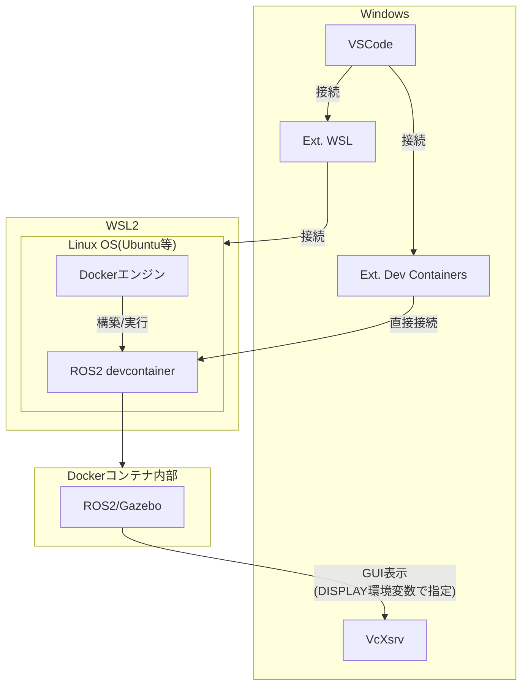

# Dev Containersの仕組み

このドキュメントでは、WindowsでVSCodeの拡張機能Dev Containersを使用してROS2を動かす際のWSL（Windows Subsystem for Linux）、Docker、及びVSCodeの関係を図解します。

## アーキテクチャ図

## 説明

1. **Windows**:
   - VSCodeはエディタとして機能し、拡張機能を通じてWSLやコンテナに接続します。
   - 図中の「Ext. WSL」は、VSCodeの「WSL」（Microsoft提供）という名称の拡張機能です。以前は「Remote - WSL」という名称でしたが名称が簡略化されました。この拡張機能はVSCodeからWSL環境に直接接続し、WSL内のファイルをネイティブに編集・実行できるようにします。
   - 図中の「Ext. Dev Containers」は、VSCodeの「Dev Containers」（Microsoft提供）という名称の拡張機能です。以前は「Remote - Containers」という名称でしたが名称が変更されました。この拡張機能はVSCodeからDockerコンテナに直接接続し、devcontainer設定に基づいたコンテナ環境を構築・利用できるようにします。
   - 「WSL」拡張機能と「Dev Containers」拡張機能は別々の独立した拡張機能であり、一方が他方に含まれているわけではありません。それぞれが異なる目的（WSL接続とコンテナ接続）を持っています。
   - VcXsrvはXサーバーとして機能し、Dockerコンテナ内部のGUIアプリケーション表示を可能にします。

2. **WSL2**:
   - WSL2はWindows上でLinuxカーネルを実行するための技術的な基盤です。
   - 図中の「Linux OS(Ubuntu等)」は、WSL2上で実行される特定のLinuxディストリビューションのインスタンスを指します。
   - 図中の「ROS2 devcontainer」は、`.devcontainer/Dockerfile`で定義されたDockerコンテナを指します。このコンテナには以下が含まれています。
     - ROS2 Iron（ベースイメージ）
     - Gazeboシミュレーター
     - 開発ツール（コンパイラ、デバッガなど）
     - ROS2ワークスペース（/home/vscode/ros2_projects）
     また、`.devcontainer/devcontainer.json`によって、VSCodeとの統合、ボリュームマウント、X11転送などが設定されています。
   - Linux OS内でDockerエンジンが動作し、Dockerコンテナを管理します。
   - DockerエンジンがROS2 devcontainerを構築・実行します。
   - この階層構造により、Windows上でLinuxアプリケーションを効率的に実行できます。

3. **Dockerコンテナ内部**:
   - GazeboなどのROS2アプリケーションが実行されます。
   - GUIアプリケーション（Gazeboなど）はX11プロトコルを使用してWindowsホスト上のVcXsrvに表示されます。

この構成により、Windows環境でもLinuxベースのROS2を効率的に開発・実行することが可能になります。

## Dockerコンテナ内部のGUIアプリケーション表示の仕組み

DISPLAY環境変数を使用したGUIアプリケーションの表示の仕組みは以下の通りです：

1. **DISPLAY環境変数の役割**:
   - DISPLAY環境変数は、X Window System（X11）でGUIアプリケーションの表示先を指定するための環境変数です。
   - 通常の形式は `DISPLAY=:0` のように指定され、`:0` はディスプレイ番号を表します。

2. **コンテナでの使用**:
   - ROS2 devcontainer内で動作するGazeboなどのGUIアプリケーションは、DISPLAY環境変数を参照して表示先を決定します。
   - devcontainer.jsonでDISPLAY環境変数が設定され、ホストのVcXsrvを指すように構成されています。

3. **表示の流れ**:
   1. VcXsrvがWindows上でXサーバーとして起動される。
   2. ROS2 devcontainerにDISPLAY環境変数が設定される。
   3. GazeboなどのGUIアプリケーションが起動時にDISPLAY環境変数を参照する。
   4. GUIアプリケーションの画面出力がVcXsrvに転送される。
   5. VcXsrvがWindowsデスクトップ上に画面を表示する。
